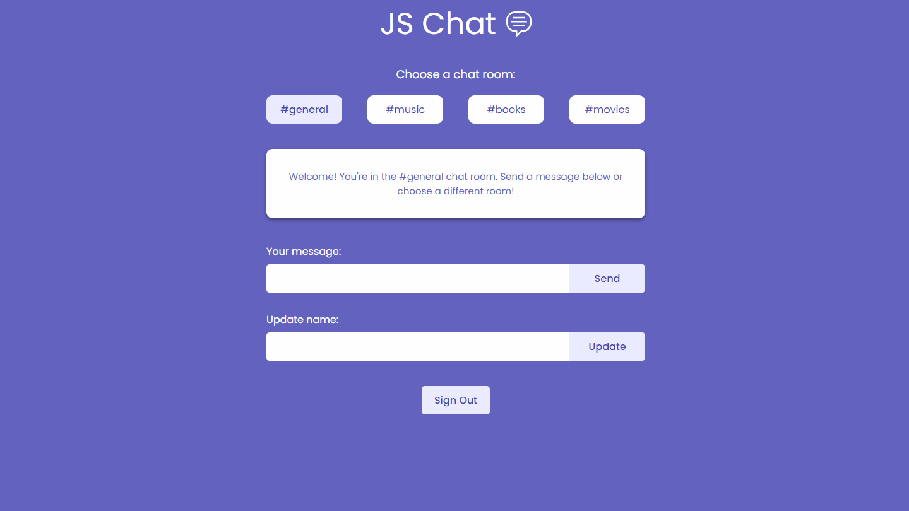

## Real-time Chat Room 💬

A real-time chat room built with HTML, CSS, JavaScript, and Firebase. The user can read the messages in the chat rooms available (general, music, books, or movies) and can sign up or login to send a message. Firestore is used as a backend database to store and retrieve chat messages, and Firebase Authentication is used to authenticate users. This project was deployed with Firebase Hosting.

### Technologies

- HTML
- CSS
- JavaScript

### Link:

- [Live Demo](https://js-projects-1ca1f.web.app/)

 

 

### Features

- [x] Choose one of the four chat rooms available: general, music, books, or movies
- [x] Sign up with email, password, and username
- [x] Login with email and password
- [x] Send a message in a chat room. Only authenticated users can send messages.
- [x] Update the username
- [x] Chat messages are stored in Firestore
- [x] The authentication state persists until explicit sign-out. User is not required to sign-in every time the web page is visited on the same device.

### Dependencies

- [Firestore/Firebase](https://firebase.google.com/products/firestore)
- [Firebase Authentication](https://firebase.google.com/products/auth)
- [Date-fns](https://www.npmjs.com/package/date-fns)

### Development Dependencies

- Webpack
- Babel
- ESLint
- CSS loader
- Style loader
- Html Webpack Plugin

### Useful Resources

- Modern JavaScript Course: [The Net Ninja (Udemy)](https://www.udemy.com/course/modern-javascript-from-novice-to-ninja/)

 

---

##### Made with 💜 by Juliana Chagas
